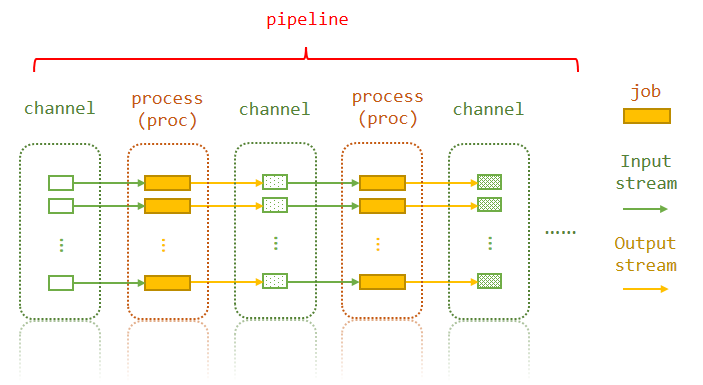

<!-- toc -->

## Layers of a pipeline



The pipeline consists of channels and processes. A process may have many jobs. Each job uses the corresponding elements from the input channel of the process (a row of the input channel/dataframe), and generates values for output channel.
Actually, what you need to do is just specify the first input channel, and then tell `pipen` the dependencies of the processes. The later processes will use the output channel of the processes they depend on. Of course, you can also modify the output channel to match the input of the next processes, using functions.

## Folder structure
```
./
|- pipeline.py
`- <pipeline-workdir>/
   `- <pipeline-name>/
      |- proc.name
      `- <job.index>/
         |- input/
         |- output/
         |- job.signature.toml
         |- job.script
         |- job.rc
         |- job.stdout
         |- job.stderr
         |- job.status
         `- job.wrapped.<scheduler>
```

| Path | Content | Memo |
|------|---------|------|
|`<pipeline-workdir>`|Where the pipeline directories of all processes of current pipeline are located.|Can be set by `workdir`|
|`<pipeline-name>`|The slugified name of the pipeline.||
|`<job.index>/`|The job directory|Starts with `0`|
|`<job.index>/output/`|Where you can find all the output files|If this is an end process, it should be a link to the output directory of this process of the pipeline|
|`<job.index>/job.signature.toml`|The signature file of the job, used to check if job is cached||
|`<job.index>/job.script`|The rendered script file||
|`<job.index>/job.rc`|To file containing the return code||
|`<job.index>/job.stdout`|The STDOUT of the script||
|`<job.index>/job.stderr`|The STDERR of the script||
|`<job.index>/job.statis`|The status of the job||
|`<job.index>/job.wrapped.<scheduler>`|The wrapper for the scheduler to wrap the script||

